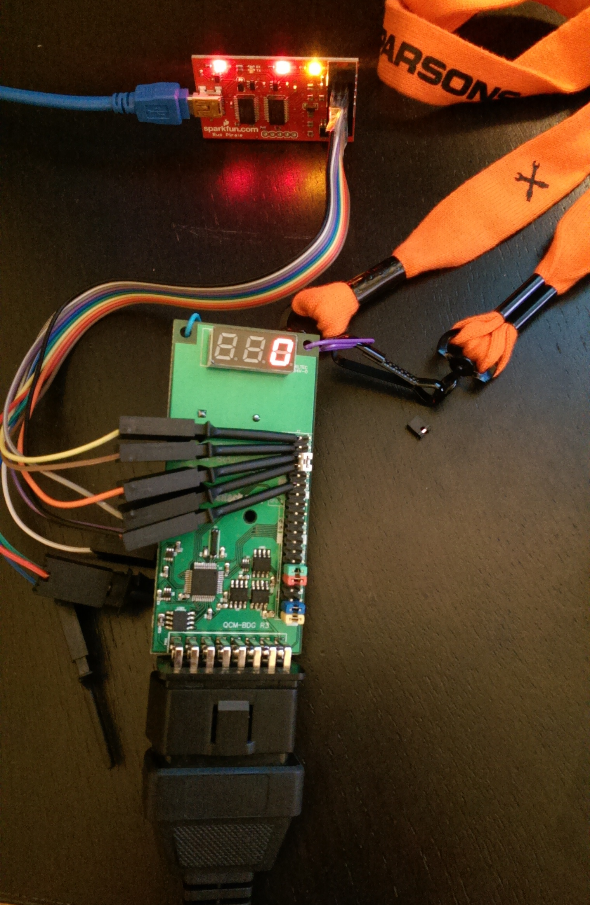

# Using a BusPirate as an FTDI Cable



## Connect the Bus Pirate

Use the below pinout to connect the Bus Pirate to the UART pins on the badge. Ground (GND) is on the bottom, and CTS does not connect to anything on the Bus Pirate.

```
CLK     (Purple)
MISO    (Black)
MOSI    (Grey)
+5V     (Orange)
CTS     ---
GND     (Brown)
```

## Configure to the Bus Pirate
```
screen /dev/ttyUSB0 115200
```

Set the Bus Pirate to use 230400

```
HiZ>b
Set serial port speed: (bps)
 1. 300
 2. 1200
 3. 2400
 4. 4800
 5. 9600
 6. 19200
 7. 38400
 8. 57600
 9. 115200
10. BRG raw value

(9)>10
Enter raw value for BRG

(34)>16
Adjust your terminal
Space to cont
```

At this point you will need to reconnect with the new speed.

```
screen /dev/ttyUSB0 230400
```

Press space to pring up the prompt. Then set the pus pirate to UART/FTDI mode at 230400bps.

```

HiZ>m
1. HiZ
2. 1-WIRE
3. UART
4. I2C
5. SPI
6. 2WIRE
7. 3WIRE
8. LCD
x. exit(without change)

(1)>3
Set serial port speed: (bps)
 1. 300
 2. 1200
 3. 2400
 4. 4800
 5. 9600
 6. 19200
 7. 38400
 8. 57600
 9. 115200
10. BRG raw value

(1)>10
Raw value for BRG (MIDI=127)

(34)>16
Data bits and parity:
 1. 8, NONE *default 
 2. 8, EVEN 
 3. 8, ODD 
 4. 9, NONE
(1)>1
Stop bits:
 1. 1 *default
 2. 2
(1)>1
Receive polarity:
 1. Idle 1 *default
 2. Idle 0
(1)>1
Select output type:
 1. Open drain (H=Hi-Z, L=GND)
 2. Normal (H=3.3V, L=GND)

(1)>2
WARNING: Possible bufferoverflow
Ready
UART>
```
Turn on the power supplies

```
UART>W
POWER SUPPLIES ON
UART>
```
Enable transparent bridge mode

```
UART> 
UART>
UART>(3)
UART bridge
Reset to exit
Are you sure? y
```
